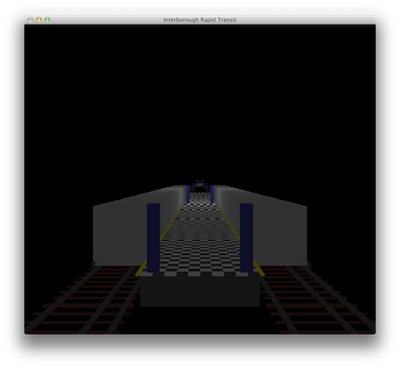
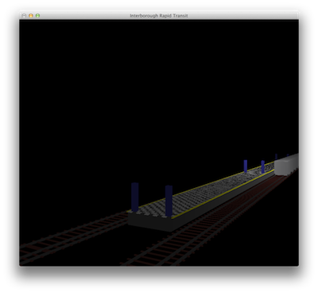
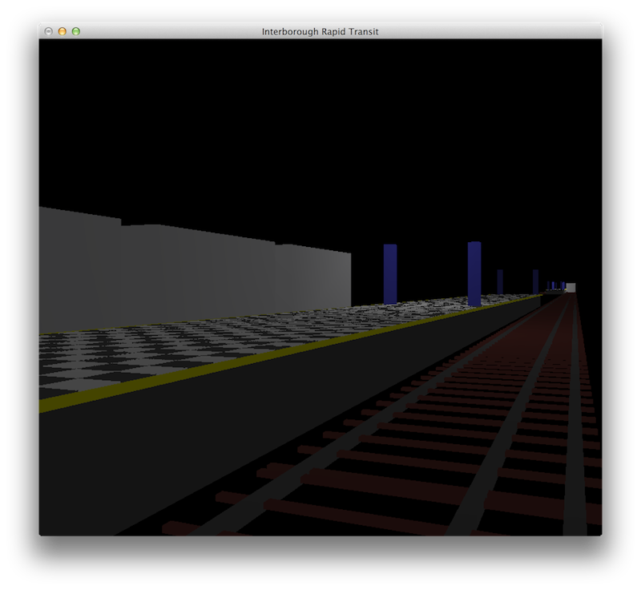

Interborough
============

A 3D model of a subway for my OpenGL class.

[Assignment spec](http://www.sci.brooklyn.cuny.edu/~meyer/CISC3620/projects/Project_1.pdf) is to model something and light it with 2 lights and load a texture. (I've omitted the texture, for lack of time.)

**Navigation:**

    W - World Forward
    S - World Backward
    A - World Left
    D - World Right
    E - World Up
    F - World Down
    
**Rotation: X Axis**

    M - Clockwise 
    N - Counterclockwise

**Rotation: Y Axis**        

    J - Clockwise
    K - Counterclockwise
    
**Rotation: Z Axis**        
    
    H - Clockwise 
    B - Counterclockwise

**Trains**

    T - Toggle train
    Z - Move Active Train Forward 
    X - Move Active Train Backward 

    Each train moves in opposite directions, so Z/X will be inverted per train.  
    
**Miscellaneous Controls:**

    L - Toggle lights
    P - Pause automatic movement
    R - Reset     